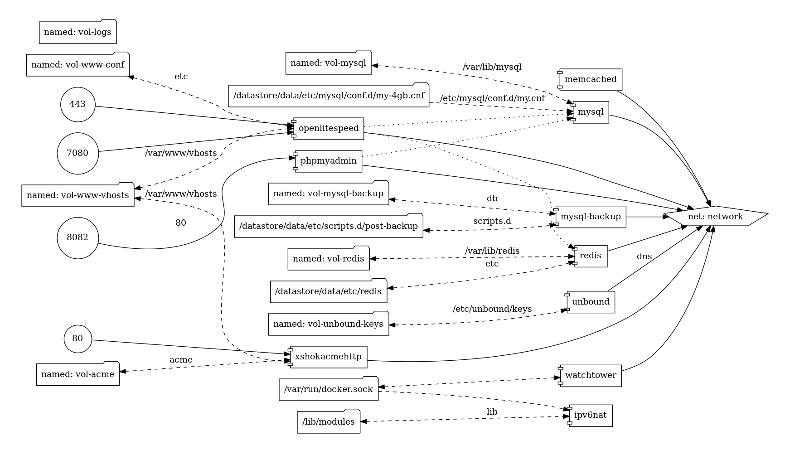
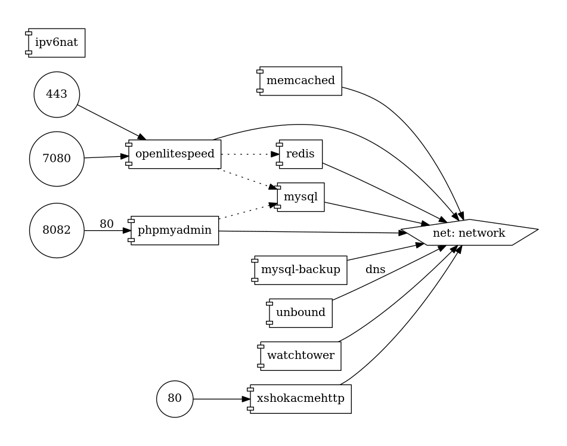

# docker-webserver
Our optimized production web-server setup based on docker

## This setup is been used for most of our web servers and has been used for more than 6 years.
* we have perfect scores on various webpage and performance tests
* There are literally thousands of sites using this platform, everything from online shops with more than 35 000 active customers to a simple blog to forums.
* In 2020 nginx + php-fpm was replaced with openlitespeed due to the massive performance advantage wordpress has with lscache.
* Everything is optimized and the config values used are derived by years of testing, tweaking and observing real world data.



### used dockers:
* extremeshok/unbound **cashing dns**
* extremeshok/openlitespeed-php **optimised openlitespeed with php webserver**
* extremeshok/acme-http2https **generates letsencrypt certificates and forwards all http to httpS**
* containrrr/watchtower **autoupdates docker containers**
* mariadb:10.5 **mysql, but better**
* tiredofit/db-backup **backup mysql databases every 1 hour**
* bitnami/phpmyadmin **webbased database admin**
* redis **caching store**
* memcached **caching store**
* robbertkl/ipv6nat **ipv6nat**

### Benefits
* optimized
* vhosts (host multiple independent domains)
* hourly mysql database backups
* simple management
* automatic updates for wordpress
* fully integrated
* stable

### Recommended setup:
* VM / VPS (as a rule, always run a vm instead of baremetal, makes it easy to upgrade and do maintenance)
* Fresh/clean UBUNTU LTS configured with the xshok-ubuntu-docker-host.sh script https://github.com/extremeshok/xshok-docker
* Project run from the /datastore dir.

### Notes:
* .env is generated on first install, as the passwords are always randomised.
* there is no need to configure or edit the docker-compose.yml
* all administration is done via xshok-admin.sh
* files are saved into the volumes dir

### Recommended VM:
2 vcpu, 4GB ram (2GB can be used), NVME storage (webservers need nvme, sata ssd is too slow and hdd is pointless)

### Usage / Installation
* Download and place the files into /datastore
* start servers
``` bash xshok-admin.sh --start ```
* start servers at boot
``` bash xshok-admin.sh --boot ```
* set a password for the litespeed weadmin https://hostname:7080
``` bash xshok-admin.sh --password ```
* add a FQDN domain, create a database and generate a letsencrypt ssl
``` bash xshok-admin.sh --qa fqdn.com ```
* restart litespeed to apply the changes
``` bash xshok-admin.sh --restart ```

# xshok-admin.sh
used to control and manage the webserver, add domains, databases, ssl etc.
```
eXtremeSHOK.com Webserver
WEBSITE OPTIONS
   -wl | --website-list
       list all websites
   -wa | --website-add [domain_name]
       add a website
   -wd | --website-delete [domain_name]
       delete a website
   -wp | --website-permissions [domain_name]
       fix permissions and ownership of a website
DATABASE OPTIONS
   -dl | --database-list [domain_name]
       list all databases for domain
   -da | --database-add [domain_name]
       add a database to domain, database name, user and pass autogenerated
   -dd | --database-delete [database_name]
       delete a database
   -dp | --database-password [database_name]
       reset the password for a database
   -db | --database-backup [database_name] [/your/path/file_name]*optional*
       backup a database, optional backup filename, will use the default sql/databasename.sql.gz if not specified
   -dr | --database-restore [database_name] [/your/path/file_name]
       restore a database backup file to database_name, supports .gz and .sql
SSL OPTIONS
   -sl | --ssl-list
       list all ssl
   -sa | --ssl-add [domain_name]
       add ssl to a website
   -sd | --ssl-delete [domain_name]
       delete ssl from a website
QUICK OPTIONS
   -qa | --quick-add [domain_name]
       add website, database, ssl, restart server
ADVANCED OPTIONS
   -wc | --warm-cache [domain_name]
       loads a website sitemap and visits each page, used to warm the cache
GENERAL OPTIONS
   --up | --start | --init
       start xshok-webserver (will launch docker-compose.yml)
   --down | --stop
       stop all dockers and docker-compose
   -r | --restart
       gracefully restart openlitespeed with zero down time
   -b | --boot | --service | --systemd
       creates a systemd service to start docker and run docker-compose.yml on boot
   -p | --password
       generate and set a new web-admin password
   -e | --env
       generate a new .env from the default.env
   -H, --help
      Display help and exit.
```

# TODO
- automated app installs (wordpress)


